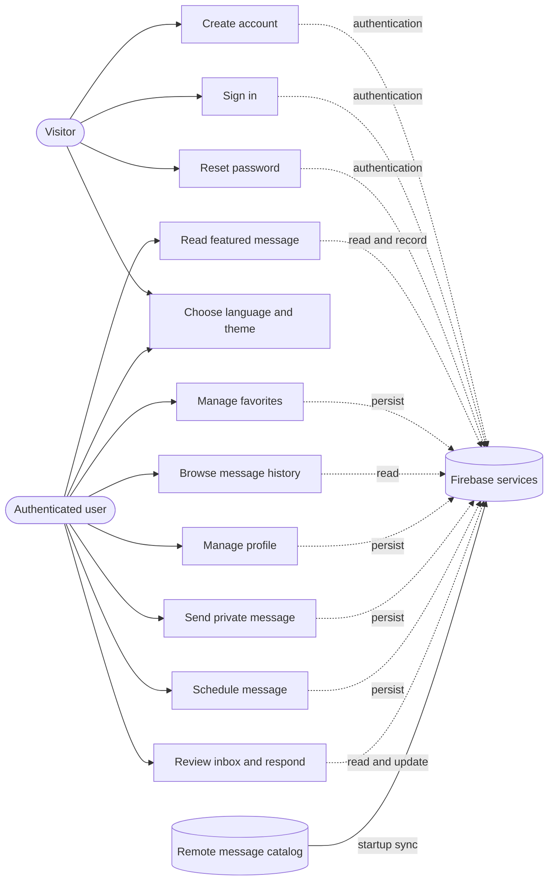
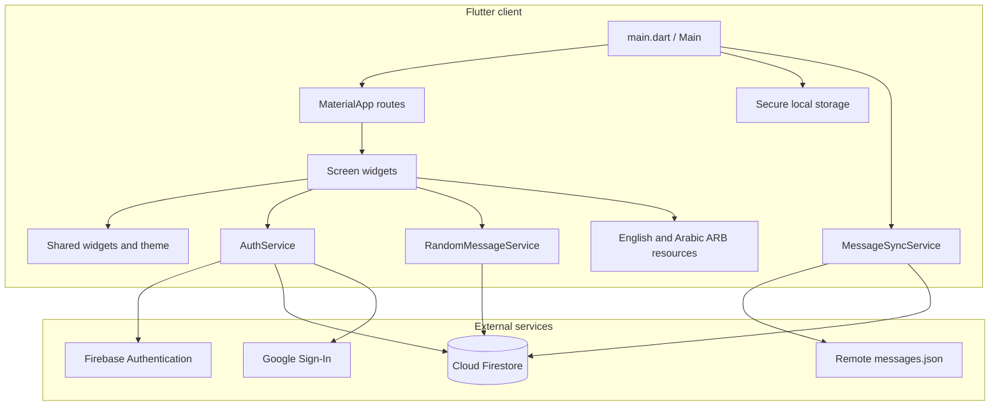
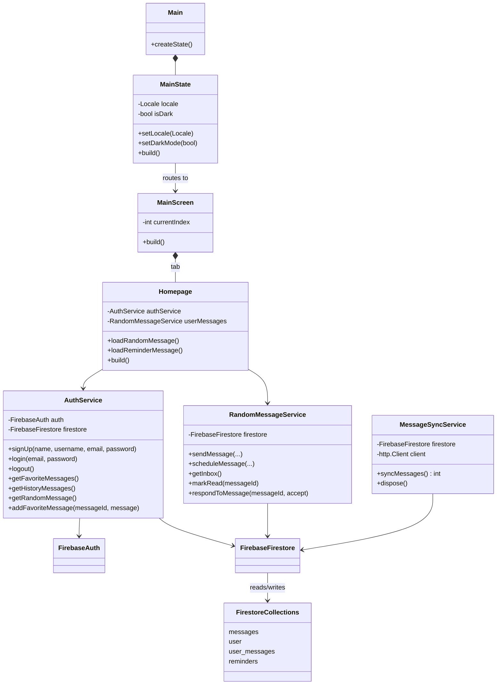
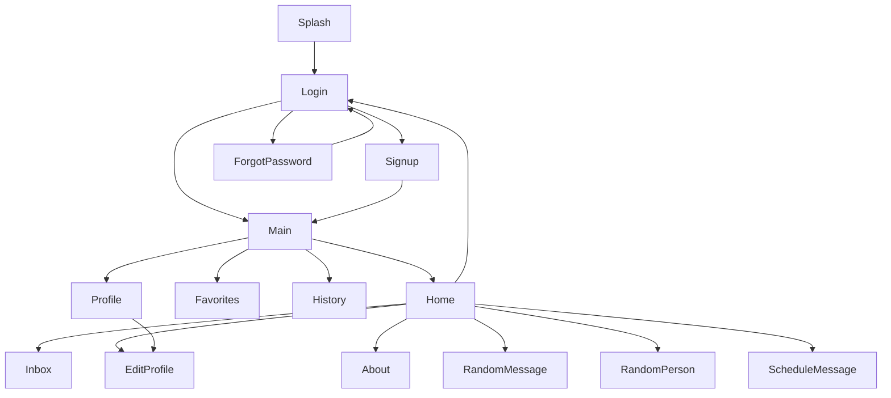
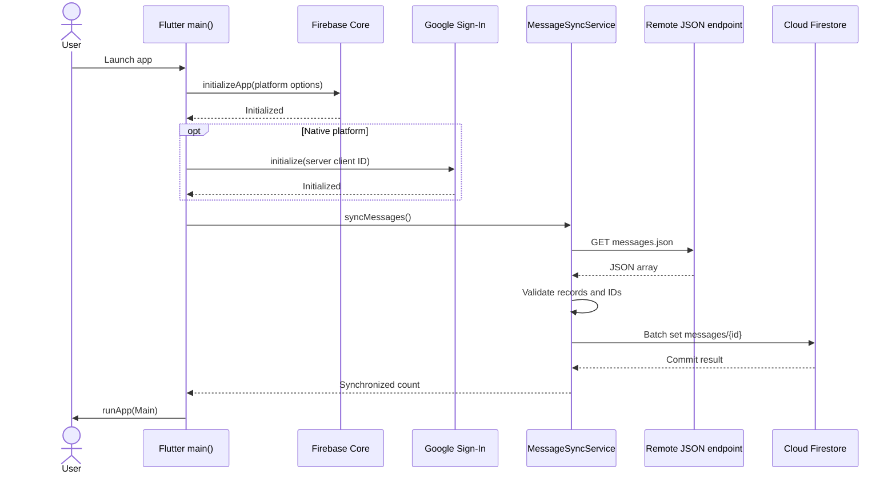
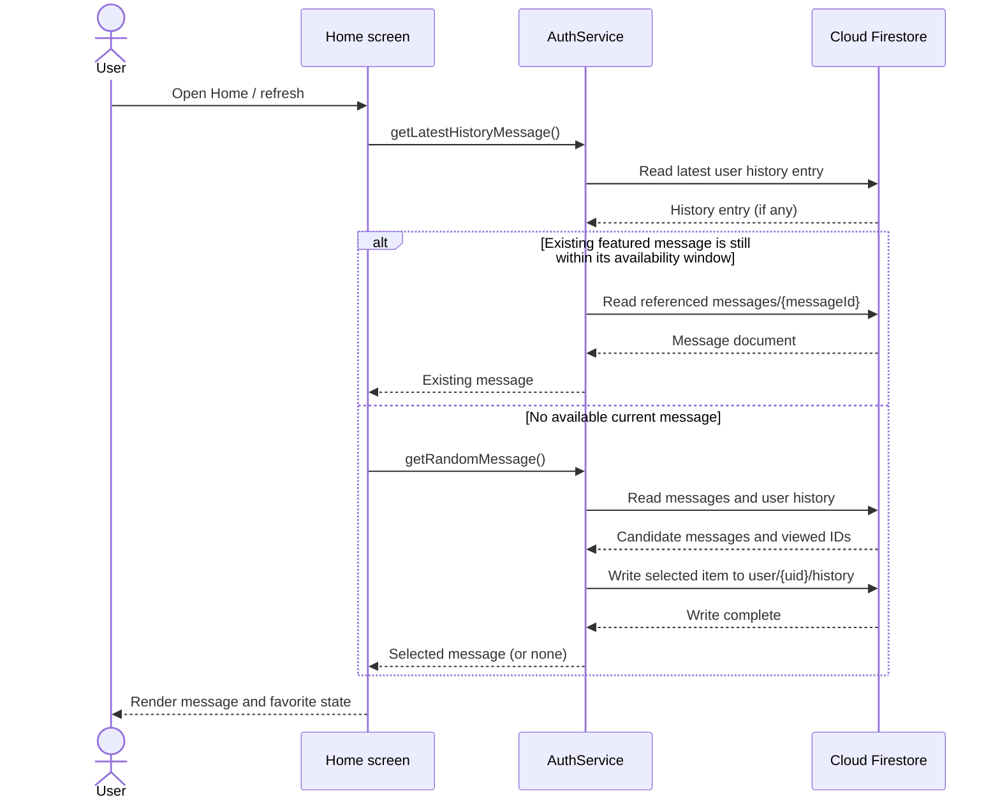
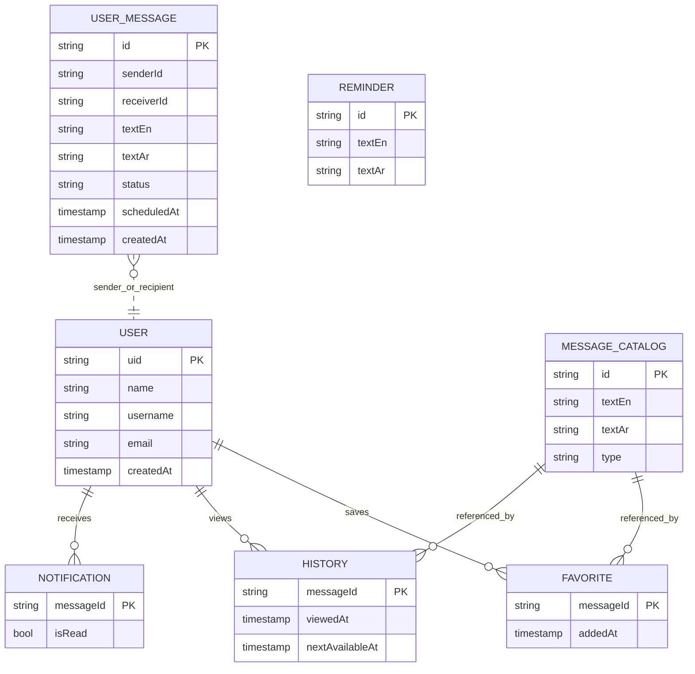

# Athar — Software Design Document

**Document status:** implementation overview  
**Version:** 1.0  
**Date:** 2026-10-04  
**Repository:** [Athar on GitHub](https://github.com/LoloAbd/Athar)  
**Application type:** Flutter client application with Firebase backend

> This document describes the code currently in this repository. Backend security rules, Firebase project settings, and production deployment configuration are managed outside the Flutter source and must be reviewed in the Firebase project.

## 1. Purpose and product overview

Athar is a bilingual application for discovering and sharing kind, inspiring messages. Users can read a featured message, keep favorites, see previously viewed messages, and send private or scheduled messages. The application supports English and Arabic, including right-to-left layout, as well as light and dark themes.

The word *Athar* conveys the idea of an impact or trace. The product is built around small positive interactions: a message can encourage the reader or help them connect with someone else.

## 2. Scope

### In scope

- Account creation and login using Firebase Authentication, including Google sign-in integration.
- Password recovery.
- User profile display and editing.
- System message catalog synchronization from a remote JSON file into Cloud Firestore.
- Featured/random message selection, reading history, and favorites.
- User-authored private and scheduled messages, with inbox/notification actions.
- English and Arabic localization, RTL layout, and persistent light/dark preference.
- Flutter mobile and desktop/web platform scaffolding present in the repository.

### External dependencies

- Firebase Authentication, Cloud Firestore, and Firebase initialization configuration.
- Google Sign-In OAuth configuration for the target platform.
- A remotely hosted `messages.json` document referenced by `MessageSyncService`.
- A Firestore `reminders` collection for reminder content.
- Network connectivity for Firebase access and message synchronization.

## 3. Actors and use cases

| Actor | Description | Main use cases |
| --- | --- | --- |
| Visitor | Person who has not signed in | Create account, sign in, reset password, choose language/theme |
| Authenticated user | Signed-in Athar user | View featured message, favorite it, browse history, edit profile, send or schedule messages, use inbox |
| Firebase services | Authentication and cloud data services | Authenticate users and persist account, message, history, favorite, and notification data |
| Message catalog source | Remote JSON endpoint | Supply system message records that are synchronized to Firestore at app startup |

### Use case diagram



## 4. Functional requirements

| ID | Requirement |
| --- | --- |
| FR-01 | The application shall allow a visitor to register and sign in, and provide an account recovery flow. |
| FR-02 | The application shall present the main app areas through Home, Favorites, History, and Account navigation. |
| FR-03 | The Home screen shall show a featured system message, quick actions, and access to inbox, settings, theme/language choices, About, and sign-out. |
| FR-04 | The application shall let an authenticated user add and remove system messages from Favorites. |
| FR-05 | The application shall record displayed system messages in per-user History and list historical messages. |
| FR-06 | The application shall support composing and delivering user-authored messages, including scheduled messages. |
| FR-07 | The inbox shall show user message notifications and allow the user to mark messages read and accept or reject pending requests where applicable. |
| FR-08 | The application shall allow users to view and edit their profile information. |
| FR-09 | The application shall support English and Arabic strings and directionality. |
| FR-10 | The application shall allow light/dark appearance selection and persist that preference using secure local storage. |
| FR-11 | At startup, the application shall attempt to synchronize system messages from the configured JSON endpoint into Firestore. A sync failure is logged and does not prevent the app from starting. |

## 5. Non-functional requirements and constraints

- **Platforms:** Flutter project configuration exists for Android, iOS, web, Windows, macOS, and Linux; availability of each feature depends on its platform configuration and plugins.
- **Localization:** English and Arabic are supported. Directionality is selected with the active language.
- **Persistence:** Cloud account and message data use Firebase. The theme preference is stored locally with `flutter_secure_storage`.
- **Network:** Account and message data features depend on network access to Firebase. Catalog synchronization is attempted during startup.
- **Security:** Firestore security rules must enforce per-user access to `user/{uid}` and its subcollections. Do not treat client-side visibility checks as access control.
- **Secrets/configuration:** Firebase and OAuth configuration are environment/project-specific. Validate them before using this code for a separate project or production release.
- **Accessibility/quality:** Flutter Material components and reusable widgets are used. Formal accessibility targets and performance service-level objectives are not defined in the repository.

## 6. System architecture

Athar follows a client application structure. Screens own presentation and user interactions; service classes encapsulate authentication and Firestore operations. Firebase is the remote identity and data layer. `MessageSyncService` downloads the initial message catalog and writes it to Firestore.

### Component diagram



### UML class diagram

The diagram focuses on the main app and service relationships; UI widget details are omitted for readability.



## 7. Screen and navigation design

| Screen | Purpose and main actions |
| --- | --- |
| Splash | Initial entry screen; exposes language and appearance controls and routes into the authentication/app experience. |
| Sign up | Creates a Firebase account and user profile document. |
| Login | Email/password or Google sign-in; can open sign-up and forgot-password screens. |
| Forgot password | Starts Firebase email password recovery. |
| Main / Home | Featured message, quick actions, inbox indicator, language/theme/settings/About/logout. |
| Favorites | User’s saved system messages. |
| History | Previously seen system messages, newest first. |
| Account / Profile | User profile summary and profile actions. |
| Edit profile | Updates fields on the signed-in user’s Firestore profile document. |
| Random message | Message composition and sending flow. |
| Random person | Recipient discovery/selection flow. |
| Schedule message | Compose a message with a delivery time. |
| Notifications / inbox | Incoming and scheduled messages; read, accept, and reject actions. |
| About | Product story and mission. |

### Navigation diagram



The bottom navigation is an `IndexedStack` containing Home, Favorites, History, and Profile. Named routes are registered in `main.dart`; screens also use direct `MaterialPageRoute` navigation for some flows.

## 8. Key runtime sequences

### Application startup and catalog synchronization



### Featured message selection



## 9. Data design

The live schema is defined through service code rather than a versioned schema file. The following diagram summarizes the collections seen in the Flutter source. Field sets can evolve independently in Firestore.



### Observed Firestore paths

| Path | Use |
| --- | --- |
| `user/{uid}` | Account profile and user-specific parent document. |
| `user/{uid}/favorites/{messageId}` | Saved system message references and `addedAt`. |
| `user/{uid}/history/{messageId}` | Viewed system message references, `viewedAt`, and `nextAvailableAt`. |
| `user/{uid}/notifications/{messageId}` | Inbox notification/read-state records. |
| `messages/{messageId}` | Synchronized system message catalog; message service also accesses user-authored records from this collection in parts of the current implementation. |
| `user_messages/{messageId}` | User-authored message collection used by `RandomMessageService`. |
| `reminders/{id}` | Home reminder message source. |

The code currently has more than one message path in use (`messages` and `user_messages`). Confirm the intended canonical schema and Firestore security rules before migrating data or deploying a new backend.

## 10. Important implementation modules

| File | Responsibility |
| --- | --- |
| `lib/main.dart` | Firebase initialization, Google Sign-In initialization, startup sync, app themes, locales, and route generation. |
| `lib/screens/main_screen.dart` | Main bottom navigation and tab selection. |
| `lib/screens/home_screen.dart` | Featured message, quick actions, drawer settings, and inbox indicator. |
| `lib/services/auth_service.dart` | Firebase Authentication and system message/profile/favorite/history operations. |
| `lib/services/random_message_service.dart` | User-authored messages, scheduling, inbox stream, and message state transitions. |
| `lib/services/message_sync_service.dart` | Downloads and batch-writes the system message JSON catalog. |
| `lib/l10n/app_en.arb`, `lib/l10n/app_ar.arb` | English and Arabic translation strings. |
| `lib/theme/app_colors.dart` | Shared color palette and theme-aware colors. |
| `lib/widgets/` | Reusable form, text, feedback, section header, and quick action widgets. |

## 11. Authentication and authorization

Firebase Authentication identifies the signed-in user. Profile documents are keyed by the Firebase UID. Favorites, history, and notifications are nested beneath that user document. User-authored message records include sender/recipient identifiers and message state.

Firestore rules are not represented in the Flutter client documentation. A deployment must enforce that users can only read and write their own profile subcollections and that message access is restricted to the sender/recipient and valid message state transitions. The app’s UI checks are not a replacement for server-side rules.

## 12. Configuration and deployment notes

- `lib/firebase_options.dart` contains FlutterFire platform configuration. Verify it belongs to the intended Firebase project.
- Android Firebase configuration is in `android/app/google-services.json`.
- Native Google sign-in requires correct OAuth client IDs and signing fingerprints. Web sign-in requires web Firebase setup and authorized domains.
- The message catalog URL is currently declared in `lib/services/message_sync_service.dart`; update it when changing the catalog host or repository.
- Enable Email/Password and Google providers in Firebase Authentication as needed.
- Create the `messages`, `reminders`, and user data collections in accordance with the app’s expected document shapes. `messages` documents are populated by startup synchronization.
- Define and deploy Firestore indexes and security rules for the queries used by the app.
- Store project-specific credentials in the appropriate platform configuration or CI secrets. Review repository history and distribution settings before sharing Firebase config files.

## 13. Build and run

Prerequisites: Flutter SDK compatible with `environment.sdk` in `pubspec.yaml`, platform SDK/toolchain, and valid Firebase configuration.

```sh
flutter pub get
flutter gen-l10n
flutter devices
flutter run -d <device-id>
```

To analyze the Dart project:

```sh
flutter analyze
```

Use the platform’s normal Flutter build command for a release artifact, such as `flutter build apk`, `flutter build ios`, or `flutter build web`, after configuring Firebase and signing/OAuth details for that target.

## 14. Known design limitations and follow-up items

- The implementation is a Flutter client using service classes, but it does not currently show a formal repository/domain layer or a documented backend API contract.
- The app attempts catalog sync on every startup. Large catalogs may exceed Firestore batch limits; consider chunking and version-aware synchronization if the catalog grows.
- The client contains a fixed Google server client ID in `main.dart`. Validate that configuration and move project-specific values into generated/environment configuration as appropriate.
- Firestore rules, automated test coverage, backup/retention policy, and production monitoring are not documented in this repository.
- Message schema and the distinction between `messages` and `user_messages` should be standardized and documented alongside backend rules.
- Arabic About screen literals should be reviewed in source encoding; localized UI strings should preferably come from the ARB resources consistently.

## 15. Glossary

| Term | Meaning |
| --- | --- |
| System message | Curated message from the synchronized catalog, available for discovery and favorites. |
| User message | Message authored by one app user for another user or for later delivery. |
| Favorite | A per-user reference to a system message the user saved. |
| History | A per-user record of a system message previously displayed. |
| Inbox notification | Per-user record used to surface an incoming or scheduled user message and its read state. |
| RTL | Right-to-left text and layout direction used for Arabic. |

## 16. References

- Source repository: [github.com/LoloAbd/Athar](https://github.com/LoloAbd/Athar)
- Flutter documentation: [docs.flutter.dev](https://docs.flutter.dev/)
- Firebase for Flutter: [firebase.google.com/docs/flutter/setup](https://firebase.google.com/docs/flutter/setup)
- Mermaid diagram syntax: [mermaid.js.org](https://mermaid.js.org/)
